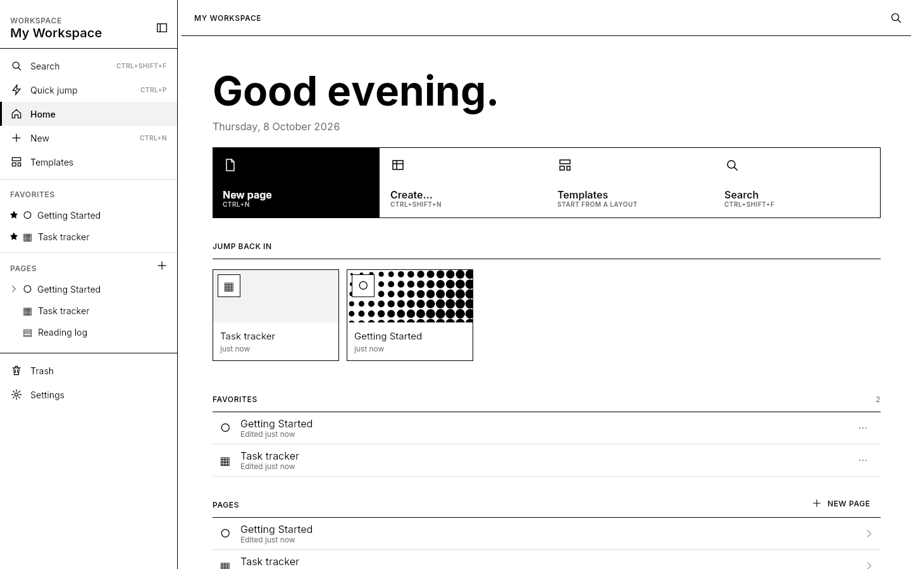
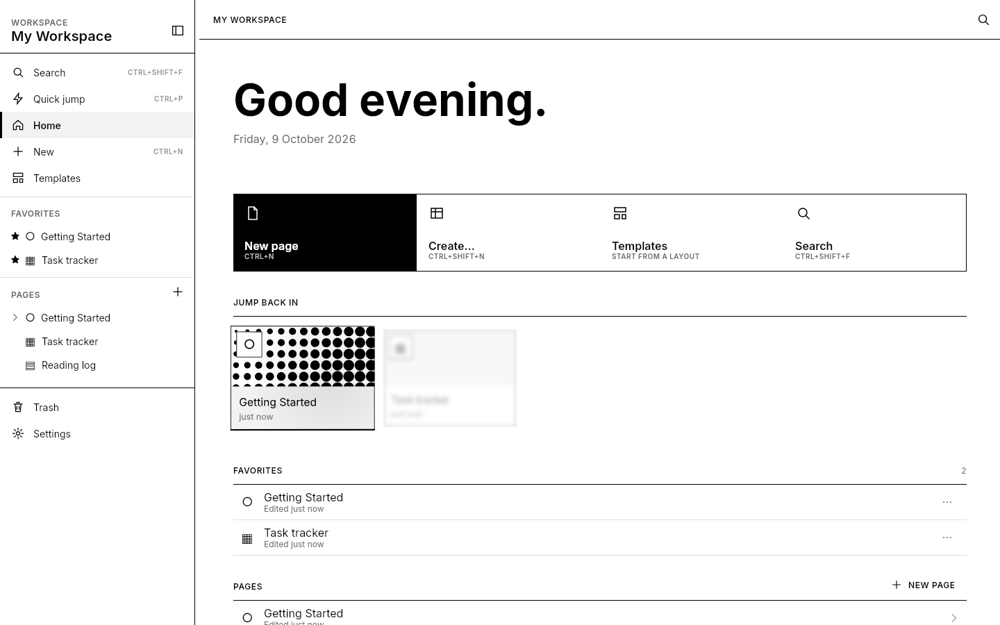
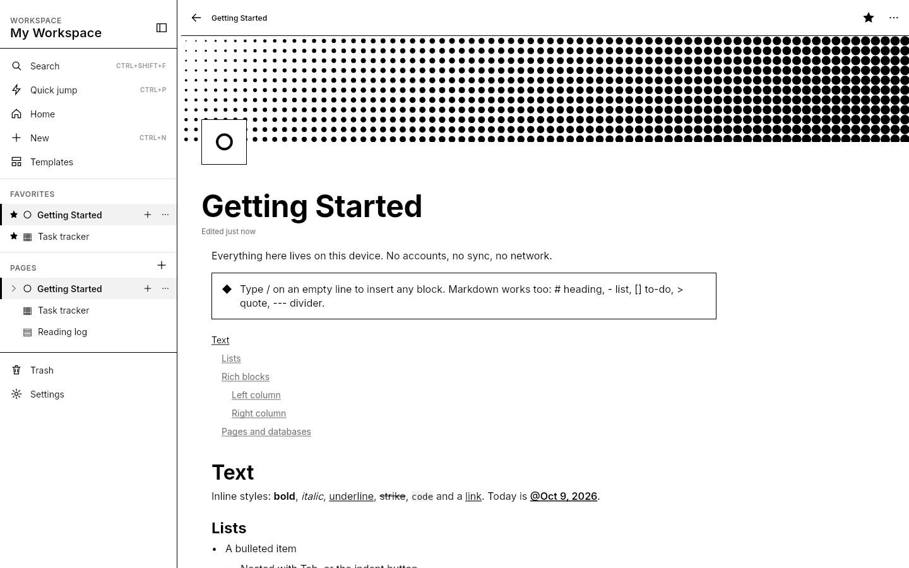
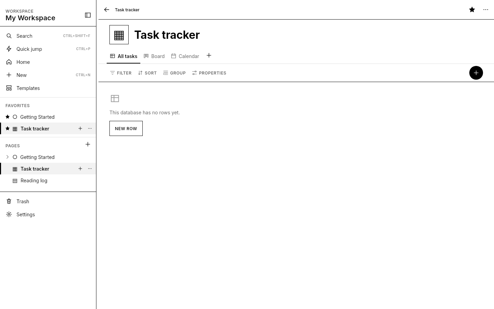
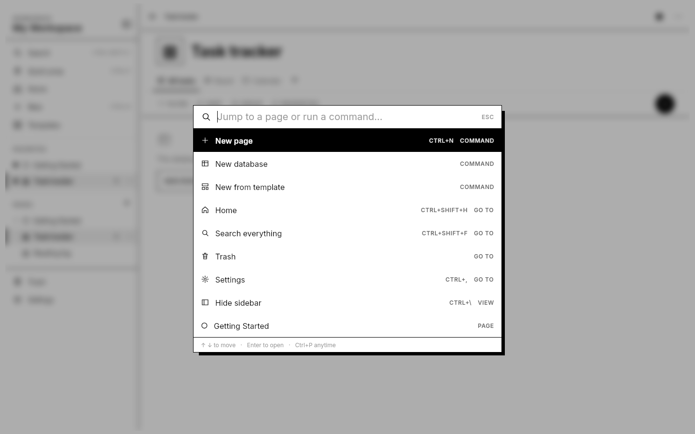
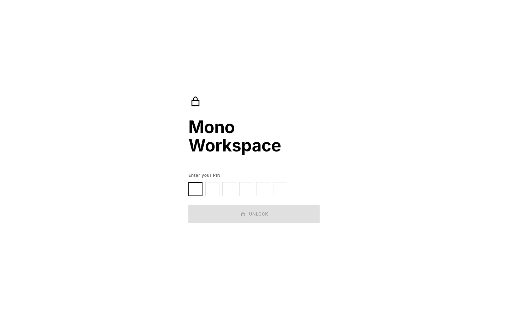

# Mono Workspace for Windows

Native Windows build of Mono Workspace (Compose Desktop): real `.exe` / `.msi` installers, Start menu entry, native window and file dialogs, bundled Java runtime, no network access.

## Download

Each push builds the rolling pre-release `desktop-<branch>` on GitHub Releases:

- `MonoWorkspace-Setup-1.0.0.exe` — per-user installer with Start menu and desktop shortcuts
- `MonoWorkspace-1.0.0.msi` — same, as an MSI
- `MonoWorkspace-Portable.zip` — unzip and run `Mono Workspace.exe`

The installers are unsigned, so SmartScreen shows "Windows protected your PC": choose **More info → Run anyway**.

## Screenshots

Rendered offscreen by CI from the real UI on every build (`./gradlew renderScreenshots`).

| | |
|---|---|
|  |  |
|  |  |
|  |  |

## Keyboard

Ctrl+P command palette · Ctrl+N new page · Ctrl+Shift+N create menu · Ctrl+Shift+F search · Ctrl+Shift+H home · Ctrl+\ sidebar · Ctrl+, settings · Ctrl+L lock · Alt+← / Alt+→ (or mouse back/forward) history · F11 full screen · Esc closes panels. Editor: Ctrl+B/I/U/E, Ctrl+Shift+S, Ctrl+K link, Ctrl+/ block menu, Tab / Shift+Tab indent.

## Choices

- **Shared engine.** `syncShared` copies the Android app's `model/`, `core/`, `engine/`, mappers and repositories into the build, so formulas, filters, rollups, export and data rules are one codebase. The Android unit tests run against the desktop build too.
- **Storage.** The workspace is held in memory and written atomically to `%APPDATA%\MonoWorkspace\db.json` half a second after each change, on focus loss and on exit. The file has the same shape as a backup's `db.json`; media sits next to it in `media\`. A corrupt file is set aside, never overwritten.
- **Backups.** `.monobackup` files are identical on Android and Windows: export on one, restore on the other.
- **Search.** In-memory token index with the same query syntax as the Android FTS table, rebuilt at start.
- **App lock.** A 4–12 digit PIN (salted, iterated SHA-256) instead of biometrics; locks on start, after 5 minutes in the background, or with Ctrl+L. Five wrong tries add a growing wait.
- **Single instance.** A second launch shows a message and exits, so two windows never overwrite each other's edits.
- **Sheets become panels.** Phone bottom sheets and dialogs render as floating panels over the app, which recedes and blurs behind them.
- **Motion.** Shared-axis page transitions with depth blur, a sidebar highlight that glides between items, cards that tilt toward the cursor with a following spotlight, magnetic icon buttons, directional button wipes, a kinetic headline and staggered entrances. Everything turns off with Settings → Reduce motion, and follows Windows' "Animation effects" setting.
- **Window.** Native title bar (snap layouts, Win+arrows work); size and maximized state are remembered; minimum size 720×520; under 1000dp wide the sidebar folds into a rail.
